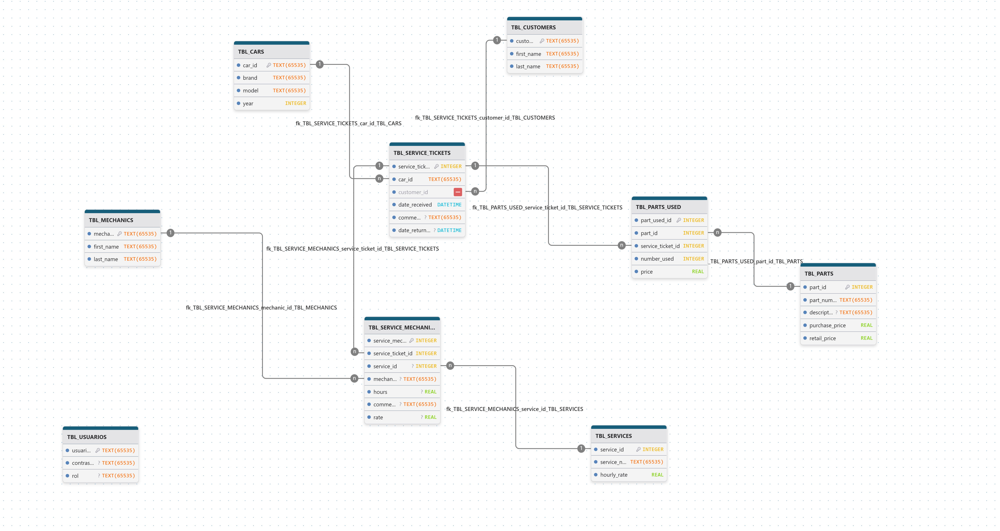

# Taller SIC - Sistema de Gestión

Sistema de gestión para un taller mecánico, cuenta con una interfaz gráfica, manejo de una base de datos relacional y cuenta con una funcionalidad para la generación facturas.


---


## Funcionalidades

- Gestión de clientes.
- Gestión de mecánicos.
- Registro de servicios.
- Gestión de piezas y repuestos.
- Generación automática de facturas PDF.
- Persistencia de datos mediante SQLite.


---


## Tecnologías y Dependencias

Este proyecto requiere un entorno Python configurado con las siguientes librerías: (`pip install [tecnología]`)

- Flet (v0.84.0): Para la renderización de la interfaz gráfica reactiva (`pip install flet==0.84.0`).
- FPDF (v1.7.2): Para la generación dinámica de facturas en formato PDF (`pip install fpdf==1.7.2`).
- SQLite3: Motor de base de datos relacional (incluido de forma nativa en Python).


---


## Instalación y Configuración

Se sugiere seguir estos pasos a pie de la letra para poder ejecutar correctamente la aplicación en local.

1. Después de la instalación de las tecnologías y dependencias, es necesario la preparación de la base de datos, para ello se debe ejecutar el archivo `Conn.py`, que aloja la creación de la base de datos relacional.

   Esto creará un archivo `SIC.DB`.

2. Luego de tener creada la base de datos, se debe seguir el siguiente orden para una correcta inserción de datos:

   `datosusuarios.py --> datosmecanicos.py --> datosservicios_partes.py`

   De esta manera los datos se insertarán correctamente en las tablas de la base de datos.


---


## Ejecución

```bash
python main.py
```

**- Para acceder a la vista del Recepcionista:**

*Usuario: Recepcionista*
*Contraseña: 123456*

**- Para acceder a la vista del Mecánico:**

*Usuario: Mecanico*
*Contraseña: 123456*


---


## Modelo Relacional de la Base de Datos



Figura 1. Diagrama relacional de la base de datos del sistema SIC.


---


## Video explicación

[](VIDEO-PROYECTO.txt)

Figura 2. Documento con el enlace al video demostrativo del sistema SIC.


---


## Autores

- Carla Turegano Martinez.
- Ivan Mesa Díaz.
- Sebastian Zahir Martinez Puerta.